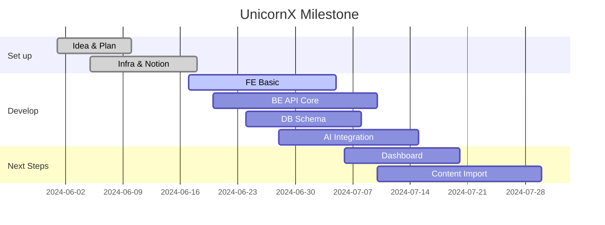
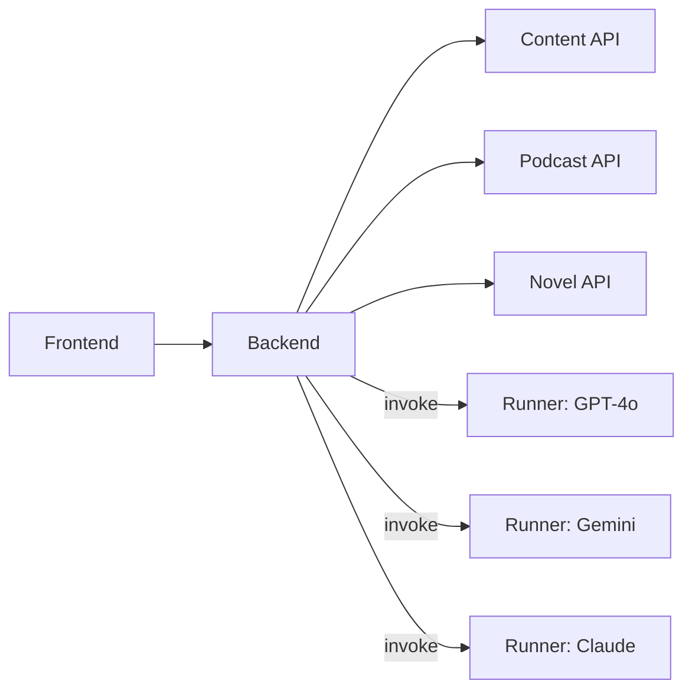

# 🦄 UnicornX OS

> บันทึกแนวคิด, โครงสร้าง, งาน และความคืบหน้าสำหรับทีม dev / content / creator by billlzzz10  
> [🔗 UnicornX-OS Notion Dashboard (เฉพาะทีม)](https://www.notion.so/UnicornX-OS-2205e81a91ff8015a7a9db9a312771e9)

---

## 🟦 สรุปเทคโนโลยีที่ใช้

- **Frontend:** React, TypeScript, Vite
- **Backend:** Node.js (Express)
- **Database:** PostgreSQL
- **Cloud & DevOps:** Google Cloud, Docker, GitHub Actions
- **AI Integration:** GPT-4o, Gemini, Claude (ผ่าน custom runner class)
- **Doc:** Notion, Markdown

---

## 📦 โครงสร้างรีโป (Repo Structure)

```
UnicornX/
├─ packages/          # source frontend/backend
├─ docs/              # อาร์ต โลโก้ เอกสาร นิยาย ฯลฯ
├─ scripts/           # tools/dev script
├─ .github/           # workflows, templates
├─ docker-compose.yml
├─ package.json
└─ README.md
```

---

## 🗺️ Overview Diagram

```mermaid
graph TD
  FE[Frontend<br/>(React/TS)]-->|API|BE(Node.js/Express)
  BE-->|ORM|DB[(PostgreSQL)]
  BE-->|Runner|AI[AI Classes]
  subgraph APIs
    API1(Content)
    API2(Podcast)
    API3(Novel)
  end
  FE-->|REST|API1
  FE-->|REST|API2
  FE-->|REST|API3
  BE-->|handle|API1
  BE-->|handle|API2
  BE-->|handle|API3
  BE-->|Cloud|GC[Google Cloud]
```

---

## 📆 Timeline คร่าว ๆ



---

## 🧑‍💻 เชื่อมโยง AI กับ API (Runner Classes)



---

## ✅ Checklist งานที่เหลือ/สำคัญ
- [x] โครง repo, Infra เบื้องต้น
- [ ] สร้าง FE UI เบื้องต้น (React+Vite)
- [ ] API endpoint: content/podcast/novel
- [ ] Design schema PostgreSQL v1
- [ ] AI Runner integration
- [ ] นำเสนอ Dashboard ใน FE
- [ ] Sync ข้อมูล/บทความจาก Notion (optional)
- [ ] ระบบ Auth/Permission (Future)
- [ ] CI/CD ด้วย Github Actions
- [ ] Deploy บน Google Cloud (Beta)

---

## ℹ️ ข้อมูลอ้างอิงและภายในทีม
- 🗂️ [UnicornX-OS Notion Internal](https://www.notion.so/UnicornX-OS-2205e81a91ff8015a7a9db9a312771e9)

---

> **หมายเหตุ:** สำหรับใช้ภายในทีม UnicornX เท่านั้น  
> อัพเดตใด ๆ ให้แก้ไขตรงนี้และ Notion ให้ตรงกัน

```

---