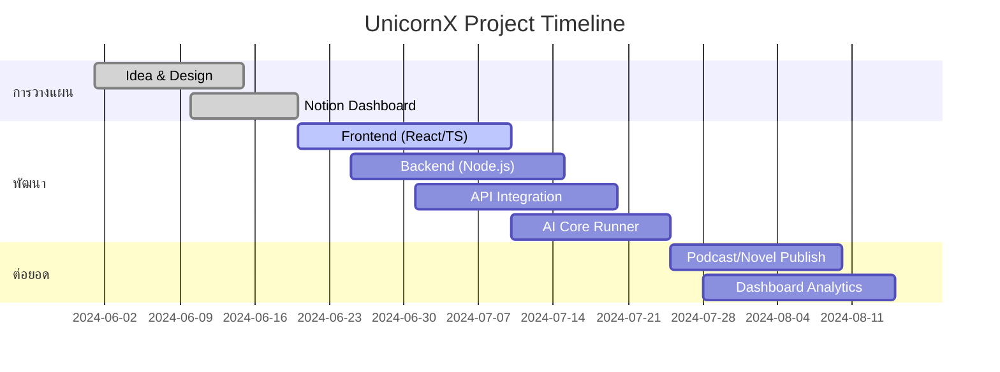
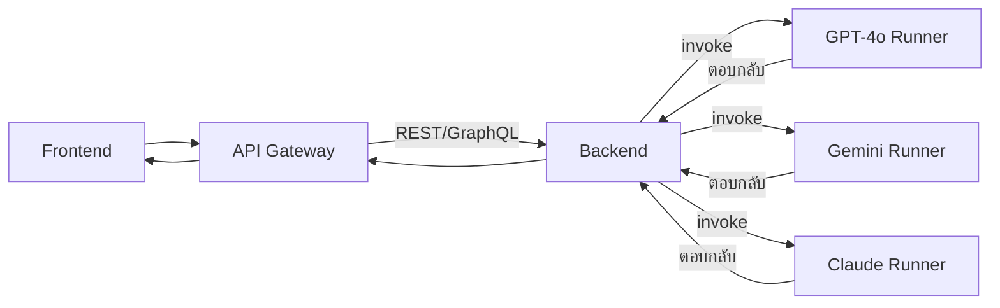

<div align="center">
  
  <br>
  <h1 style="color:#7c44c2;">UnicornX Platform</h1>
  <p style="color:#9E8AD7;font-size:1.2em;">
    ศูนย์รวมแรงบันดาลใจ เทคโนโลยี นิยาย และงานสร้างสรรค์ของ billlzzz10
  </p>
  
  
  
</div>

---

## 🚀 ลิงก์สำคัญและผลงาน

- 🪐 [UnicornX-OS (Notion Dashboard)](https://www.notion.so/UnicornX-OS-2205e81a91ff8015a7a9db9a312771e9)
- 📖 [นิยาย ROF (Read Only Fantasy)](https://www.notion.so/ROF-Story-00c7ea4e34e645cf8f4c9b719c5e9e3e)
- 🎙️ [Podcast ช่องสร้างแรงบันดาลใจ](https://www.notion.so/UnicornX-OS-2205e81a91ff8015a7a9db9a312771e9)

---

## 📊 Dashboard & Stats

<p align="center">
  
  
</p>

---

## 🪐 Project Timeline


---

## 🧩 โมดูลเชื่อมโยงแพลตฟอร์ม-ดาต้าเบส-API
---
```mermaid
graph TD
  U[UnicornX Platform]:::platform
  FE[Frontend<br/>(React/TS)]:::frontend --> U
  BE[Backend<br/>(Node.js)]:::backend --> U
  DB[(Database<br/>PostgreSQL)]:::db --> BE

  AI[AI Runner Classes<br/>(GPT-4o, Gemini, Claude)]:::ai --> BE
  API1[Content API]:::api --> BE
  API2[Podcast API]:::api --> BE
  API3[Novel API]:::api --> BE

  FE --> API1
  FE --> API2
  FE --> API3

  classDef platform fill:#7c44c2,stroke:#fff,stroke-width:2px;
  classDef frontend fill:#48d1cc,stroke:#fff;
  classDef backend fill:#9E8AD7,stroke:#fff;
  classDef db fill:#ff80bf,stroke:#fff;
  classDef ai fill:#fcb900,stroke:#282c34;
  classDef api fill:#e75480,stroke:#fff;
```
---

## 🔗 การเชื่อมโยง API กับ AI Runner Classes
---

---

## 🗂️ โครงสร้างรีโป
---
<details>
<summary>คลิกเพื่อดูรายละเอียด</summary>

```
UnicornX/
├── packages/         # โค้ดหลัก (frontend/backend)
├── docs/             # เอกสาร, โลโก้, อาร์ตเวิร์ก, นิยาย
├── scripts/          # dev tools, automation
├── .github/          # GitHub Actions, templates
├── docker-compose.yml
├── package.json
├── README.md
...
</details>

---

## ⚡ GitHub Actions ตัวอย่าง (CI/CD)
---
```yaml
# .github/workflows/ci.yml
name: UnicornX CI

on:
  push:
    branches: [main]
  pull_request:
    branches: [main]

jobs:
  build-and-test:
    runs-on: ubuntu-latest
    steps:
      - uses: actions/checkout@v4
      - uses: actions/setup-node@v4
        with:
          node-version: "20"
      - run: npm install
      - run: npm run build
      - run: npm test
```

---

## 🌈 Brand Style

| โทนสี      | Hex       | ตัวอย่าง           |
|:-----------|:---------:|:------------------:|
| Violet     | #7c44c2   |  |
| Blue       | #48d1cc   |  |
| Pink       | #ff80bf   |  |
| Gray       | #9E8AD7   |  |

---

<div align="center">
  <b>🌠 UnicornX: สะท้อนจักรวาลแห่งแรงบันดาลใจและเทคโนโลยี 🌠</b><br>
  <a href="https://www.notion.so/UnicornX-OS-2205e81a91ff8015a7a9db9a312771e9"></a>
</div>
```

---

