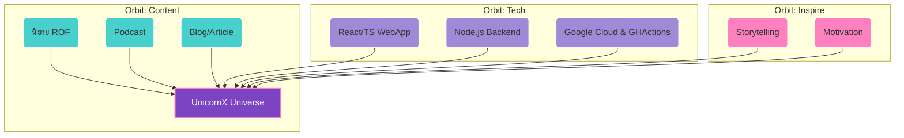

# README.md ที่ตอบโจทย์คุณ

```markdown
<div align="center">
  
  <br>
  
  <h1 style="color:#7c44c2; font-family: 'Prompt', sans-serif;">UnicornX: สะท้อนจักรวาลแห่งแรงบันดาลใจและเทคโนโลยี</h1>
  <p style="color:#9E8AD7; font-size:1.2em;">
    แพลตฟอร์มกลางของ<br>
    <b>โค้ด | คอนเทนต์ | แรงบันดาลใจ | นิยาย ROF | พอดแคสต์</b>
  </p>
  
  
  
</div>

---

## 🪐 Interactive Dashboard

<!-- GitHub Readme Stats -->
<p align="center">
  
  
</p>

<!-- Mermaid graph Example (Skill Tree) -->
<details>
  <summary><b>🌌 Skill Tree & Repo Structure (คลิกเพื่อขยาย)</b></summary>


</details>

---

## 🏗️ โครงสร้างรีโป (Repo Structure)

```
UnicornX/
├── packages/         # โค้ดหลัก (frontend/backend)
├── docs/             # เอกสาร, โลโก้, อาร์ตเวิร์ก, นิยาย
├── scripts/          # เครื่องมือ dev/tooling
├── .github/          # GitHub Actions, templates
├── docker-compose.yml
├── package.json
├── README.md
...
```

---

## 🚦 GitHub Actions (CI/CD ตัวอย่าง)

```yaml
# .github/workflows/ci.yml
name: UnicornX CI

on:
  push:
    branches: [main]
  pull_request:
    branches: [main]

jobs:
  build-and-test:
    runs-on: ubuntu-latest
    steps:
      - uses: actions/checkout@v4
      - uses: actions/setup-node@v4
        with:
          node-version: "20"
      - run: npm install
      - run: npm run build
      - run: npm test
```

---

## 🌈 Brand Colors & Visual

| สีแบรนด์      | โค้ด HEX  | ตัวอย่าง           |
|---------------|:---------:|:-------------------:|
| Saturn Violet | #7c44c2   |  |
| Neptune Blue  | #48d1cc   |  |
| Pink Dream    | #ff80bf   |  |
| Dream Gray    | #9E8AD7   |  |

---

## 🦄 About

> “UnicornX คือจักรวาลแห่งแรงบันดาลใจ เทคโนโลยี และการสร้างสรรค์ ที่เชื่อมโยงทุกสิ่งเข้าด้วยกัน”

- **Frontend:** React, TypeScript, Vite
- **Backend:** Node.js, Express
- **Cloud:** Google Cloud, Docker
- **Content:** นิยาย ROF, Podcast, Blog
- **AI Core:** GPT-4o

---

<p align="center">
  <br>
  <b>Let’s build your universe!</b>
</p>
```

---

### วิธีนำไปใช้ & คำแนะนำ
- เปลี่ยนลิงก์โลโก้/ภาพ gif ให้ตรงกับของคุณจริง (หรืออัปโหลดใน docs/assets)
- Mermaid diagram จะ interactive (expand/collapse) ถ้าเปิดใน GitHub web
- Dashboard ใช้ badge, GitHub Readme Stats, Mermaid, gif/ภาพ
- หากต้องการแดชบอร์ดแบบ React/Next ให้แยกเป็นหน้าใน unicornx-web ได้

ถ้าต้องการโค้ดตัวอย่างสำหรับแดชบอร์ด React แบบ interactive จริงๆ สามารถแจ้งได้เลยครับ!  
หรืออยากปรับแต่งสี โลโก้ ไฟล์ action เพิ่มเติม—ก็แค่บอกมาเลยครับ 😊